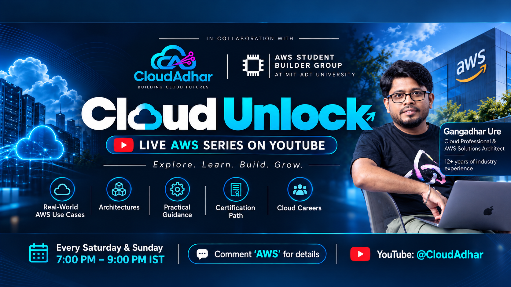

 

### ☁️ **CloudAdhar** × **AWS Student Builder Group at MIT ADT University** ☁️

---

## 🔗 Join Cloud Unlock

**🚀 Cloud Unlock: live every Saturday & Sunday, 7 PM – 9 PM IST. See you live! 🚀**

---

## 🎯 What is Cloud Unlock?

Learn AWS **from zero**, practise every week, share your progress, and get ready for the **AWS Certified Cloud Practitioner (CLF-C02)** exam. No cloud experience needed.

> 👨‍🏫 **Trainer:** Gangadhar Ure, Cloud Professional & AWS Solutions Architect

| ☁️ Real-world AWS use cases | 🏗️ Architectures | 🛠️ Practical guidance | 🎓 Certification path | 💼 Cloud careers |
|:-:|:-:|:-:|:-:|:-:|

`#5WeeksOfAWS` `#AWS5WeekChallenge` `#CloudUnlock` `#CloudAdhar` `#AWSStudentBuilderGroup` `#MITADT`

## 🧭 How the challenge works

| Step | What you do |
|:-:|---|
| 1️⃣ | **Watch** the live class (Saturday and Sunday) or the recording |
| 2️⃣ | **Read** the week folder: short notes, labs and PDFs |
| 3️⃣ | **Practise** in your own AWS account (the Free plan is enough) |
| 4️⃣ | **Submit** your work as a pull request (see [RULES.md](RULES.md)) |
| 5️⃣ | **Post** on LinkedIn in your own words with the hashtags above |
| 6️⃣ | **Revise** with the quiz prep file before the next week |

A new week folder is uploaded here every Saturday. Every folder has the same structure.

## 🗺️ Roadmap

| Week | Dates (2026) | Topics | Exam domain | Folder |
|:-:|---|---|:-:|:-:|
| 🟠 **1** | 10-11 Oct | Why cloud, AWS account, global infrastructure, shared responsibility, root MFA, budget | 1, 2, 4 | [week-01](week-01) |
| 🔵 **2** | 17-18 Oct | IAM, security, governance and compliance | 2 | [week-02](week-02) |
| 🟢 **3** | 24-25 Oct | Storage, VPC and your first EC2 | 3 | [week-03](week-03) |
| 🟣 **4** | 31 Oct - 1 Nov | Scaling, serverless, containers, edge, databases, migration | 3 | [week-04](week-04) |
| 🔴 **5** | 7-8 Nov | Analytics, AI/ML, integration, operations, Well-Architected | 3, 1 | [week-05](week-05) |
| 🏆 **Finale** | 14-15 Nov | Pricing, support, capstone, mock exam, careers | 4 | [week-06-finale](week-06-finale) |

> 📌 Dates may shift (for example around festivals). Follow YouTube and the WhatsApp group for updates.

## 📊 The four exam domains

| Domain | Weight |
|---|:-:|
| 🟧 1. Cloud Concepts | **24%** |
| 🟦 2. Security and Compliance | **30%** |
| 🟩 3. Cloud Technology and Services | **34%** |
| 🟪 4. Billing, Pricing and Support | **12%** |

Exam: 65 questions, 90 minutes, pass mark 700/1000. Check [aws.amazon.com/certification](https://aws.amazon.com/certification/) for current details.

## 🛡️ Safety first

- ✅ Use your **own** AWS account and set a **budget alert** first
- ✅ Use synthetic (fake) data and **clean up** after every lab
- ❌ Never share access keys, OTP, MFA QR code, card details or your account ID

## 📚 Start here

- 📜 [RULES.md](RULES.md): safety, submission and fair-play rules
- 🟠 [week-01](week-01): your first week

**Explore. Learn. Build. Grow.** ☁️

Community learning project. Not an official AWS course. AWS is a trademark of Amazon.com, Inc.

