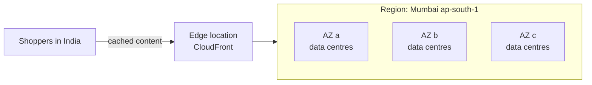

# Day 2 - Global Infrastructure and Ways To Access AWS

Exam tasks: 3.1 (ways to access and operate AWS), 3.2 (global infrastructure)

## Terms
- **Region**: geographic area with multiple isolated locations (Mumbai `ap-south-1`).
- **Availability Zone (AZ)**: one or more data centres in a Region with separate power and networking.
- **Edge location**: site close to users that caches content (CloudFront).
- **Local Zone / Wavelength Zone**: compute closer to a city / inside 5G networks.



Availability Zones are physically separate, with their own power, cooling and networking, connected by fast private links. They **do not share a single point of failure**, so running in two or more AZs keeps you up if one AZ fails.

Live counts are on aws.amazon.com/about-aws/global-infrastructure. Do not memorise numbers; check the live page.

## How To Choose A Region
1. Compliance and data residency
2. Latency to users
3. Service availability
4. Cost

## When To Use More Than One Region
- Disaster recovery and business continuity (a whole Region has a problem)
- Low latency for users on different continents
- Data sovereignty (each country's data stays in that country)

Exam pointer: data must stay in a country = choose a Region there. Users far away = CloudFront. High availability = multiple AZs. Region-wide disaster recovery = multiple Regions.

## Four Ways To Access AWS
| Way | What it is | Example |
|---|---|---|
| AWS Management Console | Web browser, click to use | What you used on Day 1 |
| AWS CLI | Commands in a terminal | `aws ec2 describe-regions` in CloudShell |
| AWS SDKs | Call AWS from your code (Python, Java, JavaScript...) | A Python app uploading to S3 with `boto3` |
| Infrastructure as Code | Describe resources in a file, AWS builds them | AWS CloudFormation, AWS CDK |

All four call the same AWS APIs underneath.

Exam pointer: repeatable, automated deployments = Infrastructure as Code (CloudFormation). Access from application code = SDK.

One-time or repeatable?
- One-time task, such as exploring or checking a setting: the Console is fine.
- Same thing many times, or in many accounts or Regions: use the CLI, scripts or IaC.

## Practice Rule

Use the Mumbai Region (`ap-south-1`). These labs only **read** information. They create nothing and cost nothing.

Practice in this order:

1. Open CloudShell.
2. Check the AWS CLI.
3. List Regions.
4. List Availability Zones.
5. Check the Health Dashboard.

## Lab 1 - First Commands In CloudShell
CloudShell is a terminal in your browser. The AWS CLI is already installed and you are already signed in. It has no extra cost.

1. Sign in to the [AWS Console](https://console.aws.amazon.com/). Check the Region at the top right is **Mumbai**.
2. Click the **CloudShell** icon (a small terminal `>_`) at the top of the Console, next to the search bar. Or search `CloudShell`.
3. Wait for the terminal to load. The first time can take a minute.
4. Type each command and press Enter:

```bash
aws --version
aws configure list
```

Expected result:
- `aws --version` shows a version number, for example `aws-cli/2.x.x`.
- `aws configure list` shows where your credentials come from. You did not type any key.

Do not post `aws sts get-caller-identity` output; it shows your account ID.

## Lab 2 - Region And AZ Explorer

Run each command one by one in CloudShell:

```bash
aws ec2 describe-regions --query "Regions[].RegionName" --output text
```
Expected result: a list of Region codes. Find `ap-south-1` (Mumbai).

```bash
aws ec2 describe-regions --all-regions --query "Regions[].[RegionName,OptInStatus]" --output table
```
Expected result: a table. Some Regions show `not-opted-in`, for example Hyderabad `ap-south-2`. Do **not** enable them for this lab.

```bash
aws ec2 describe-availability-zones --region ap-south-1 --query "AvailabilityZones[].[ZoneName,ZoneId,State]" --output table
```
Expected result: Mumbai AZs such as `ap-south-1a`, each with a zone ID such as `aps1-az1` and state `available`. Take your screenshot here.

```bash
aws ec2 describe-availability-zones --region us-east-1 --query "AvailabilityZones[].ZoneName" --output text
```
Expected result: N. Virginia AZ names. Different Region, different AZs.

Notes:
- Opt-in Regions (such as Hyderabad `ap-south-2`) must be enabled before use. Do not enable them for this lab.
- Zone names are mapped per account; zone IDs are the same for everyone.

Close CloudShell when you finish.

## Lab 3 - AWS Health Dashboard
1. Search `Health` in the Console and open **AWS Health Dashboard**.
2. Open **Service health**. Filter by **Asia Pacific (Mumbai)**.
3. Open **Your account health**. Check for open issues or scheduled changes.

Expected result: you can write one line about what the dashboard shows for Mumbai. Often it shows no current issues.

Health Dashboard shows AWS events that may affect you. It costs nothing.

## Lab 4 - Choose A Region For A Shopping App

Scenario: you run a shopping app like Flipkart or Myntra for customers across India. Customer data (names, addresses, orders) must stay in India, and pages must load fast for shoppers in India.

Write four lines in your `notes.md`, one for each factor:

```text
Compliance:
Latency:
Service availability:
Cost:
My Region choice:
```

Tip: check the [AWS global infrastructure map](https://aws.amazon.com/about-aws/global-infrastructure/) and the [Regional services list](https://aws.amazon.com/about-aws/global-infrastructure/regional-product-services/).

## Deliverables
- Screenshot of the Region list output
- Screenshot of the Mumbai AZ table (account ID hidden)
- Four-line Region choice for the shopping app
- One line: what did the Health Dashboard show for Mumbai?

## If You Get Stuck

| Problem | Try this |
|---|---|
| CloudShell keeps loading | Wait 2 minutes, refresh the page, check the Region is Mumbai |
| `UnauthorizedOperation` error | Sign in as the root user for this lab (IAM users come in Week 2) |
| My `ap-south-1a` is different from my friend's | Normal. Compare the **ZoneId** column instead |

```text
I listed the Regions. CloudShell would not load for the AZ command, so I will retry tomorrow.
```

## Official Links
| Topic | Link |
|---|---|
| AWS global infrastructure | https://aws.amazon.com/about-aws/global-infrastructure/ |
| Regions and Availability Zones | https://docs.aws.amazon.com/AWSEC2/latest/UserGuide/using-regions-availability-zones.html |
| Services available in each Region | https://aws.amazon.com/about-aws/global-infrastructure/regional-product-services/ |
| Availability Zone IDs | https://docs.aws.amazon.com/ram/latest/userguide/working-with-az-ids.html |
| Amazon CloudFront (edge locations) | https://aws.amazon.com/cloudfront/ |
| AWS CloudShell | https://docs.aws.amazon.com/cloudshell/latest/userguide/welcome.html |
| AWS CLI | https://aws.amazon.com/cli/ |
| AWS SDKs and tools | https://aws.amazon.com/developer/tools/ |
| AWS CloudFormation (Infrastructure as Code) | https://aws.amazon.com/cloudformation/ |
| AWS Health | https://docs.aws.amazon.com/health/latest/ug/what-is-aws-health.html |
