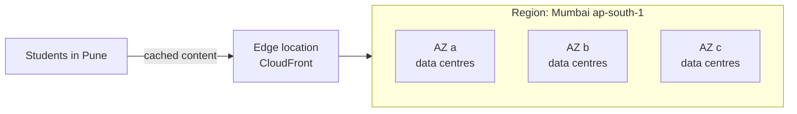

# Day 2 - Global Infrastructure and Ways To Access AWS

Exam tasks: 3.1 (ways to access and operate AWS), 3.2 (global infrastructure)

## Terms
- **Region**: geographic area with multiple isolated locations (Mumbai `ap-south-1`).
- **Availability Zone (AZ)**: one or more data centres in a Region with separate power and networking.
- **Edge location**: site close to users that caches content (CloudFront).
- **Local Zone / Wavelength Zone**: compute closer to a city / inside 5G networks.



Availability Zones are physically separate, with their own power, cooling and networking, connected by fast private links. They **do not share a single point of failure**, so running in two or more AZs keeps you up if one AZ fails.

Live counts are on aws.amazon.com/about-aws/global-infrastructure. Do not memorise numbers; check the live page.

## How To Choose A Region
1. Compliance and data residency
2. Latency to users
3. Service availability
4. Cost

## When To Use More Than One Region
- Disaster recovery and business continuity (a whole Region has a problem)
- Low latency for users on different continents
- Data sovereignty (each country's data stays in that country)

Exam pointer: data must stay in a country = choose a Region there. Users far away = CloudFront. High availability = multiple AZs. Region-wide disaster recovery = multiple Regions.

## Four Ways To Access AWS
| Way | What it is | Example |
|---|---|---|
| AWS Management Console | Web browser, click to use | What you used on Day 1 |
| AWS CLI | Commands in a terminal | `aws ec2 describe-regions` in CloudShell |
| AWS SDKs | Call AWS from your code (Python, Java, JavaScript...) | A Python app uploading to S3 with `boto3` |
| Infrastructure as Code | Describe resources in a file, AWS builds them | AWS CloudFormation, AWS CDK |

All four call the same AWS APIs underneath.

Exam pointer: repeatable, automated deployments = Infrastructure as Code (CloudFormation). Access from application code = SDK.

One-time or repeatable?
- One-time task, such as exploring or checking a setting: the Console is fine.
- Same thing many times, or in many accounts or Regions: use the CLI, scripts or IaC.

## Lab 1 - First Commands In CloudShell
CloudShell is a browser terminal with the AWS CLI already set up. It has no extra cost.
Open CloudShell (terminal icon at the top of the Console) in Mumbai and run:

```bash
aws --version
aws configure list
```

Do not post `aws sts get-caller-identity` output; it shows your account ID.

## Lab 2 - Region And AZ Explorer
```bash
aws ec2 describe-regions --query "Regions[].RegionName" --output text
aws ec2 describe-regions --all-regions --query "Regions[].[RegionName,OptInStatus]" --output table
aws ec2 describe-availability-zones --region ap-south-1 --query "AvailabilityZones[].[ZoneName,ZoneId,State]" --output table
aws ec2 describe-availability-zones --region us-east-1 --query "AvailabilityZones[].ZoneName" --output text
```
Notes:
- Opt-in Regions (such as Hyderabad `ap-south-2`) must be enabled before use. Do not enable them for this lab.
- Zone names are mapped per account; zone IDs are the same for everyone.

## Lab 3 - AWS Health Dashboard
1. Search `Health` in the Console and open AWS Health Dashboard.
2. Open **Service health** and filter by Asia Pacific (Mumbai).
3. Open **Your account health** and check for open issues or scheduled changes.

Health Dashboard shows AWS events that may affect you. It costs nothing.

## Deliverables
- Screenshot of the Region list output
- Screenshot of the Mumbai AZ table (account ID hidden)
- Four-line Region choice for a fest-registration site for students in Pune
- One line: what did the Health Dashboard show for Mumbai?
